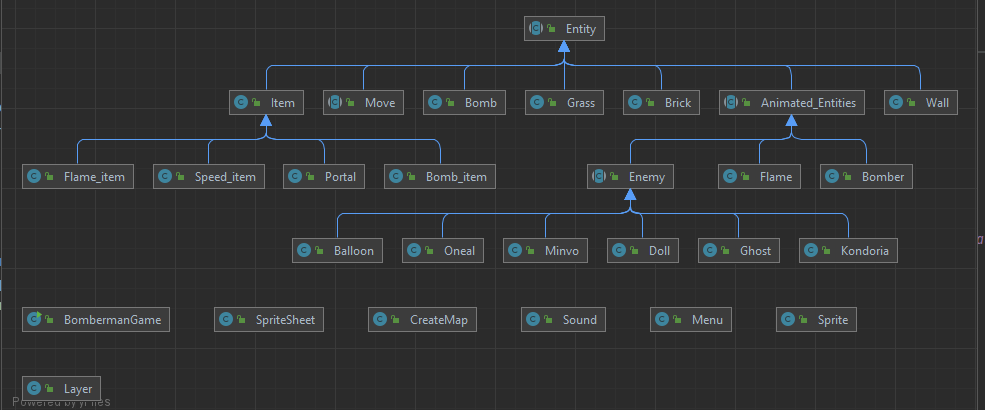

# Bài tập lớn môn Lập trình hướng đối tượng (OOP) - Trường Đại học Công nghệ - Đại học Quốc gia Hà Nội (UET)

**Game Bomberman**

Các thành viên: 
1. Nguyễn Đức Thiện 
2. Tạ Khánh Phương

Sử dụng: 
1. Java
2. JavaFx

Các chức năng chính: 
1. Gameplay giống bản classic
2. Có âm thanh

Hướng dẫn choi: 
1. Di chuyển bằng 4 phím mũi tên, khi chơi hết số bom mà không qua được màn thì thua
2. Bấm Space để kích bổ bom
3. Sử dụng các phím tắt trên màn để chỉnh Pause/New game tùy ý

Cây thừa kế:

https://strategywiki.org/wiki/Bomberman/How_to_play
